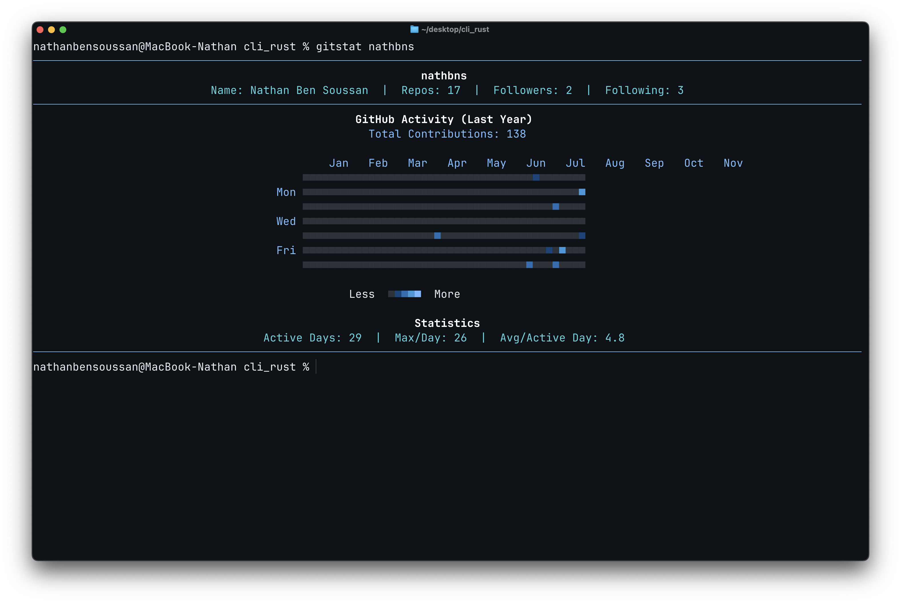

# GitStat 

A terminal CLI tool to display GitHub activity schemas for any user.



## Features 

- **Dark blue theme**
- **Real GitHub data** - Uses GitHub's GraphQL API for accurate contributions
- **Fast & lightweight** - Built in Rust for max perf
- **Simple usage** - Just provide a username and token

## Installation 

### From crates.io (Recommended)
```bash
cargo install gitstat
```

### From source
```bash
git clone https://github.com/nathbns/gitstat
cd gitstat
cargo install --path .
```

## Usage 

### Basic usage
```bash
# Set your GitHub token (get one at https://github.com/settings/tokens)
export GITHUB_TOKEN=your_token_here
gitstat username
```

### With token as argument
```bash
gitstat --token your_token_here username
```

### Examples
```bash
# View your own contributions
gitstat nathbns

# View any public user's contributions  
gitstat octocat
```

## GitHub Token 

You need a GitHub personal access token to use this tool:

1. Go to https://github.com/settings/tokens
2. Click "Generate new token (classic)"
3. Select **only** the `read:user` permission
4. Copy the token and use it with the `--token` flag or `GITHUB_TOKEN` environment variable

## Output 

GitStat displays:
- User information (name, repos, followers, following)
- Contribution calendar with color-coded activity levels
- Statistics (active days, max contributions per day, averages)


## Requirements 

- Rust 1.70+ 
- GitHub personal access token
- Terminal with color support (**Ghostty** recommended)

## License 

MIT License - see LICENSE file for details.

## Contributing 

Contributions are welcome!

